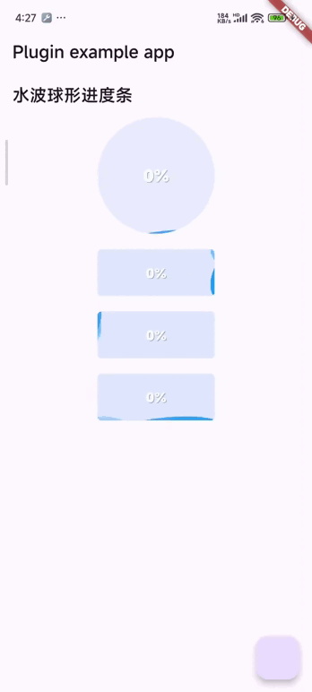

# flutter_progress_bar_button

This is a Flutter animation progress button plugin

## Start

## Table of contents

- [circular_progress_button](#circular)
- [rectangle_progress_button](#rectangle)



### Simple Use Circular

<a id="circular"></a>

```dart
int progress=5;
CircularAnimatedProgressBar(
    size: 150,
    progress: (progress.clamp(0, 10) / 10),
    onPressed: () {
        setState(() {
        progress += 2;
        });
    })
```

### Simple Use Circular

<a id="circular"></a>

```dart
int progress=5;
 RectangleAnimatedProgressBar(
            progress: (progress.clamp(0, 10) / 10),
            enumPosition: PositionEnum.right,
            colorsWave: const [
              Color(0x4D2196f3),
              Color(0x662196f3),
              Color(0xCC2196f3),
            ],
            backgroundColor: const Color(0x262192F3),
            
          )
```
